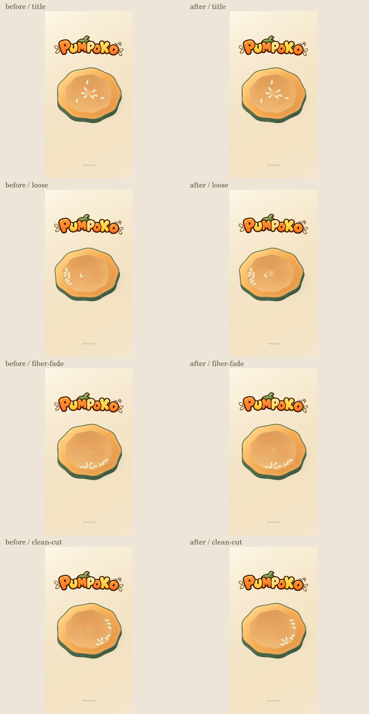
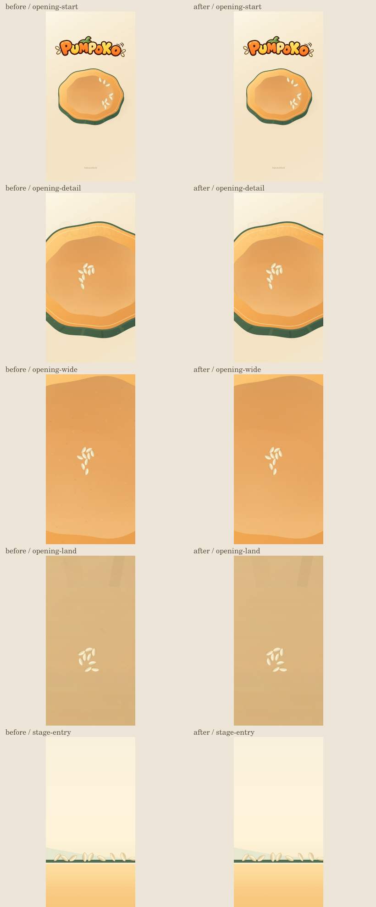
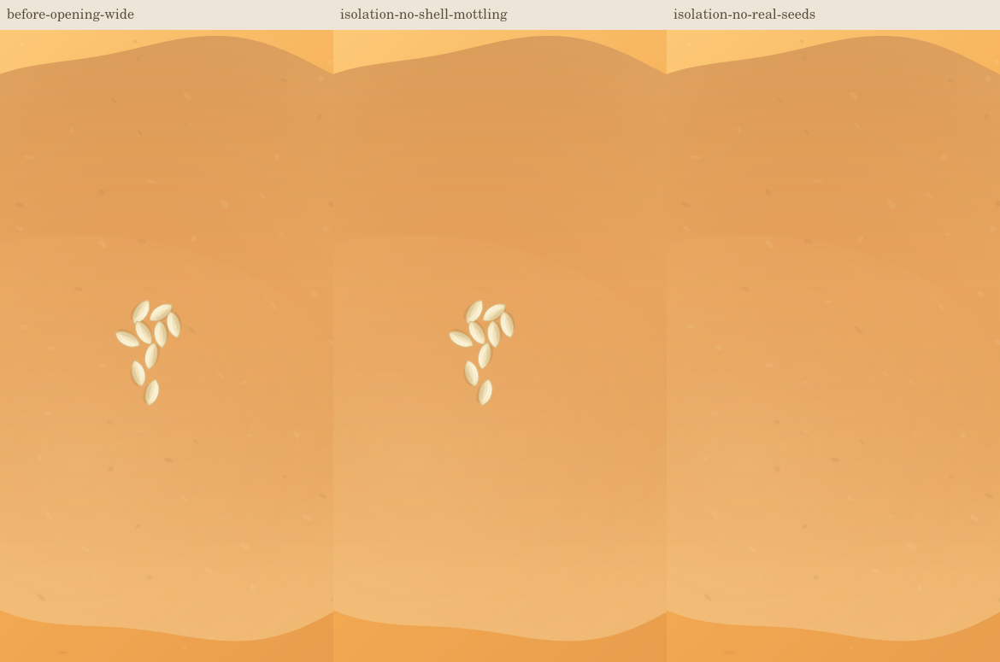
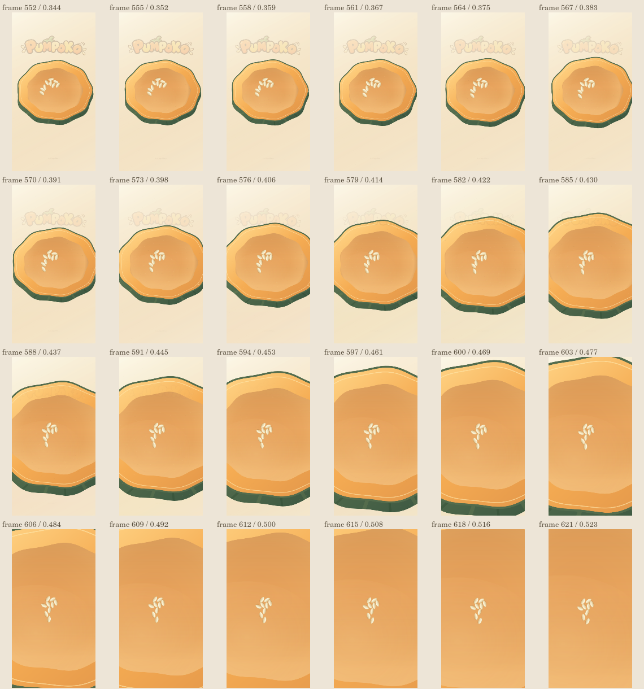

# PUMPOKO title / opening cleanup

Base: staging/main `0c1a67b1a617e0ca05418e518ec19f2fff46119c`, merged PR #169 including restored pumpkin oranges. Same branch: `feat/pumpoko-material-world-20261007`. PR #169 is already merged, so this follow-up needs a new Draft PR. No merge, deploy or production changes are authorized.

## Findings and changes

- The visible grab hint and its hint-only bookkeeping are removed. The canvas accessible name is now PUMPOKO. SukimaStock stays in the same place.
- Only the logo moves, with a 7-second sine cycle and amplitude 1.2 logical pixels vertically. No rotation, scale pulse, physics coupling or extra animation clock. The incoming return title uses the same paused prologue model as the next title, avoiding a phase/position jump. The text fallback follows the same offset.
- Marks are movement tracks, generated at 22 Hz and retained for up to 18 seconds. Detached tethers retract exponentially but were still stroked as little stubs. They were visible in the existing 1.8-second pause, before Journey creates an empty marks array. Pulp previously stopped drawing immediately when the last attached seed released.
- Attachment remnants now keep a .25-second quiet interval, then fade over 1.05 seconds. At 1.3 seconds they have zero opacity and no marks/tether draw calls. Pulp participates in the same fade instead of switching off instantly. This leaves .5 seconds of a clean cut inside the existing pause. The physical seeds are independent of that opacity; model marks, tethers, seeds, detachments and openAt are unchanged.
- Opening isolation shows two different things: the nine real gameplay seeds stay at their own scale, while the shell's tiny mottling ellipses are magnified with the shell and look like extra seed-shaped spots. Removing only shell mottling in a diagnostic render removes those spots; removing only real seeds leaves the spots. There is no extra detached-seed copy or transition tether drawing.
- The shell's microscopic grain smoothly attenuates only as `Journey.opening` goes from 0 to .12, before the spots grow to large marks. Title/return rind and flesh keep their full mottling; all orange gradients, broad shade/warmth, terrain texture, contact shadows and fruit shading stay intact. Stage draw, geometry, physics and camera files are byte-identical to the merged PR #169. The nine real seeds remain visible; they are gameplay objects, not remnants.

## Offscreen comparison

These are native Canvas renders of the actual scene code, not browser/device screenshots. Plumbing is stubbed; touch, model, geometry and drawing are the real work implementations. The original comparison renderer is historical PR #169 evidence; use `opening-review.cjs` for this follow-up.









## Validation

- Real `scene.touch` BEGAN/MOVING/ENDED, no detached-state injection, releases all nine seeds at 5.2 seconds with the chosen repeatable gesture. Transition starts at 7.0 seconds: the existing 1.8-second pause is unchanged.
- 165 before/after frame pairs sampled every three frames at 60 fps from the last release through Stage 1 entry. Every update has an identical complete model graph, including positions, velocities, attachment damage, marks, camera, transition and timers. Every draw asserts the read-only gameplay probe is unchanged.
- Attachment strokes are absent after 1.3 seconds; intermediate tether opacity is between zero and one. Transition has exactly nine real seed draws; shell detail strength is zero after its fade threshold.
- Selected title/fade/opening comparisons and the 24-frame enlargement strip were visually inspected. The strip shows a clean expanding cut without the old attachment tracks or magnified grain spots.
- Initial pumpkin crop, Stage 1 entry and nine ripe fruits/field renders are PNG-byte-identical to base. The seed drawing function and title orange stops are byte-identical. Stage-draw/dynamics/journey/geometry/data/Codea/work-config are unchanged.
- Logo measured vertical range: 2.4 logical pixels (±1.2). SukimaStock is still drawn, grab hint is never drawn. The Hero-return title and resumed prologue have continuous logo position.
- All existing 71 Node runner tests passed after the final edit; legacy assertion scripts also passed. No test weakened or replaced.
- Scope → Risk → Impact and base-owned trusted node syntax are checked at the published head and recorded in the PR. These are not a Release Complete or final VERIFIED claim.

Reproduce from the repository root with `@napi-rs/canvas` available in NODE_PATH:

```sh
node works/pumpoko/visual-review/opening-review.cjs "$PWD" /tmp/pumpoko-title-review
node --test works/pumpoko/test-*.cjs
```

Physical iPhone/iPad Safari, live browser candidate operation, audio, resize and real device performance remain UNVERIFIED. Native Canvas does not establish Japanese glyph rendering. Formal verificationState remains UNVERIFIED. The live staging site continues to show merged main; the follow-up is intentionally not deployed.

Plan: `.change-plans/pumpoko-title-cleanup-20261007/r0.lock.json`, digest `07b6589fc43e696f46d5722321fd0b2c73e1121caa5fc882763a3166b8a98afc`. Rollback: revert the cleanup implementation commit; keep PR #169 and its material/orange changes. No state migration.
