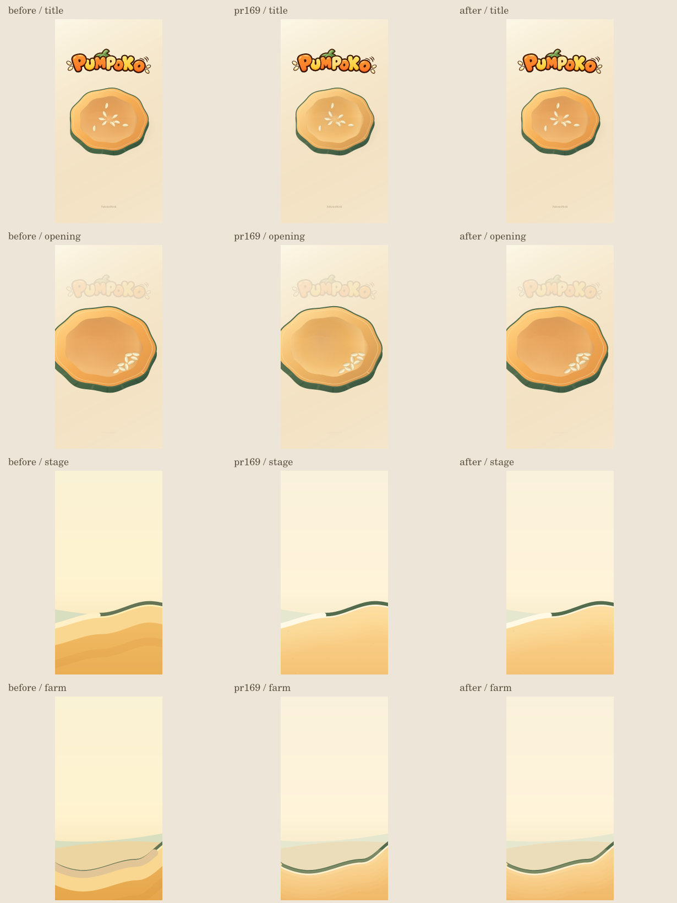
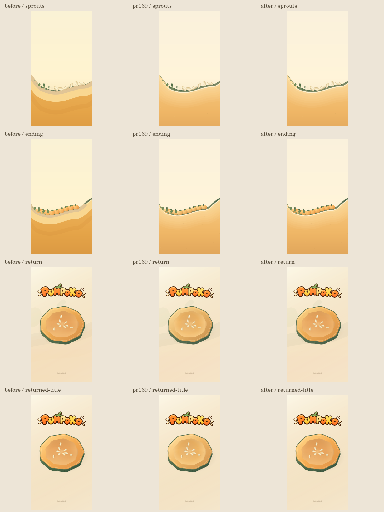

# PUMPOKO material world review

This is a drawing-only unification, on staging main `1b87ad41ec7c4f66e359ab30ed050a13b039576b` (#168). The existing #145 ending shot and #168 Audio lifecycle are retained. Old Draft #140 is untouched. Draft only: no merge, deploy or production operation.

## What changed

- One work-local palette relates the deep green cut rind and terrain/loop edges, soft yellow-orange land, cream seeds and quiet air layers. Actual cut flesh and ripe fruit retain warmer, more saturated orange tones within that material family.
- Two conspicuous terrain strata become a broad, feathered shoulder. A low-opacity, fixed material-space grain gives the existing surfaces texture. Cached compound paths are bounded to 32 entries; no random or animated noise.
- The nursery surface cue is translucent rather than an opaque beige cover. It uses exactly the same path, width and appearance before arrival and throughout growth.
- Existing distant curves have lower contrast. Their paths and parallax stay unchanged.
- Seed silhouettes retain their soft shape with a small contact shadow; ripe fruit keeps its lobes and adds diffuse underside shade. Plants keep their existing slots, quantities, reward richness and growth times.
- No additional scenery, grass slots, flowers, UI, HUD, particles, audio, gameplay or assets loaded by the game. The original logo is retained.

## Comparison

Left: before (`1b87ad41`). Middle: original PR #169 (`3470fc0b`). Right: orange follow-up. These are offscreen Canvas renders of the actual sketch and stage-draw code, not browser screenshots. The fixtures and exact input sequence are identical.





The follow-up restores the original pumpkin gradient colors in the title cut flesh, hollow and ripe fruit, while keeping PR #169 texture and shading. Land, nursery, seeds, leaves and air retain PR #169 colors; the background stays sparse and weaker than the ground and objects. The same Hero becomes the same cut shell during the existing return.

## Orange follow-up (2026-10-07)

User requested before's appetizing orange for actual pumpkins while retaining the material-world update. The immutable r0 Plan remains applicable: same WORK / Standard drawing scope, sources, protected behavior and review paths. Main and original PR head were rechecked; main remains `1b87ad41`, with no competing work changes. PUMPOKO remains active / staging-only.

Only four drawing-source lines changed from `3470fc0b`: title flesh (3 gradient stops), hollow (4 stops over 2 lines), fruit body (3 stops). All ten stop colors are exactly before's values, at the same gradient positions. No shared terrain palette changes.

The three-version renderer asserts every other byte of sketch/stage-draw is identical to PR #169, including rind, mottling, fruit underside shade, contact shadows, seed/leaf colors, background, terrain and nursery. Stage 1, nursery and sprouts renders are PNG-byte-identical between original PR #169 and the follow-up. The drawing probe remains unchanged on every render. Title, opening, nine ripe fruits, same Hero return and renewed title were visually compared; the warmer oranges remain consistent through the return.

## Evidence and reproduction

- `node --test works/pumpoko/test-*.cjs`: all 71 Node runner tests passed (the legacy scripts also report their own assertions). Covers input/transfer/physics/jumps, builder, loop, 0/1/2/3/9 arrivals, growth, camera timing and Audio continuity/recovery.
- `visual-review/render.cjs`: 24 logical frames across eight states and three versions, plus 390×844 / 844×390 fitted versions (48 additional frames, 72 total). Every draw asserts the read-only gameplay probe is unchanged. An additional byte comparison proves all sketch code outside the two seed/vessel render functions is unchanged; journey/dynamics/geometry/data/Codea/HTML/work-config are unchanged.
- The fitted images use the unchanged Engine's scale=min(width/390,height/740) layout. They establish composition only, not native resize, input or device behavior.
- 390×740 frames and the portrait/landscape result composition were visually inspected. The logo, empty sky, silhouette and Hero framing remain intact. The offscreen environment does not establish Japanese font rendering.
- Release Validator output is byte-identical to base: 45 PASS / 1 FAIL / 2 WARNING / 2 EXTERNAL_CHECK_REQUIRED. The existing FAIL is `pumpoko metadata.identity`: no WORKS entry. This Phase does not register or promote the work, or weaken checks.
- Scope → Risk → Impact and trusted syntax are recorded at the exact PR head in the PR description. No claim of Release Complete or final VERIFIED.

Run from the repository root with `@napi-rs/canvas` available in NODE_PATH:

```sh
node works/pumpoko/visual-review/render.cjs "$PWD" /tmp/pumpoko-visual-review
node --test works/pumpoko/test-*.cjs
```

The renderer uses stub Engine/input/audio plumbing with native Canvas2D and the real work code/model. Its fixtures deliberately position the camera or seeds; it is not an end-to-end user playthrough. It captures title/opening, Stage 1, nursery, sprouts, nine ripe fruits, return and renewed title. The PNGs are review evidence only and are never loaded by the game.

## Remaining checks

Physical iPhone/iPad Safari, live browser input/audio/resize, actual frame cost on devices and the owner's subjective touch/material judgment remain UNVERIFIED. Draw-loop timing from the offscreen backend is not a browser FPS claim. Formal verificationState remains UNVERIFIED under the current repository contract.

Rollback: revert this work-local implementation commit. No save migration or shared-runtime rollback is required. The staged public URL continues to show main until a later, separately authorized merge.
