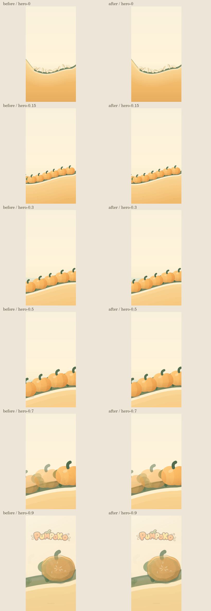
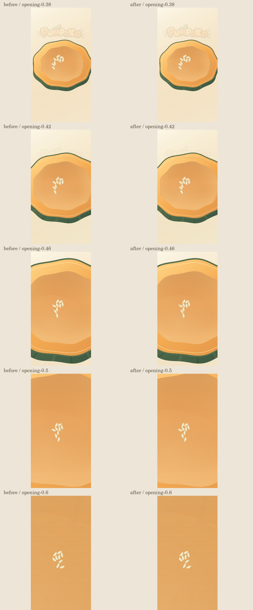

# PUMPOKO zoom texture follow-up

Base: staging/main `c331b66589f0602706e6f587c36aaac5eba358d9` (merged PR170).
Plan digest: `694fb88b56efa84868aa4817a29866b27d155adf3f01379b9bc50da7b0f34659`.
Formal verificationState: **UNVERIFIED**. Native Canvas evidence is not device verification.

## Cause and drawing policy

Fruit mottling used fixed local ellipses; the Hero camera magnified those dots with the fruit. The previous shell suppression only used opening progress, leaving the return fruit unaffected.

Both pumpkin surfaces now opt into the same `mottling` policy. A frame-relative Canvas transform measures the largest surface scale, normalizing backing resolution/DPR and rotation. Grain remains full below 2 logical pixels per material unit, fades smoothly from 2x to 3x, and is not drawn beyond 3x. Broad gradients, warm orange, underside/contact shadows, lobes and highlights remain. Terrain/background mottling is unchanged. The returning cut shell naturally regains its normal-size grain as its local transform settles into the title pose.

No timers, physics state, input, camera paths, audio, geometry, seed drawing or rules changed. Original nine seeds remain visible through opening; they are gameplay objects, not surface texture. No dotted stroke is introduced by this change.

## Reproducible checks

```sh
NODE_PATH="$CODEX_PRIMARY_RUNTIME_NODE_MODULES" node works/pumpoko/visual-review/zoom-review.cjs "$PWD" /tmp/pumpoko-zoom-review
node --test works/pumpoko/test-*.cjs
```

Native Canvas executes the real scene touch/update/draw; Engine/DOM plumbing is stubbed. At 60fps, 1181 before/after frame pairs were compared every three frames across opening and automatic returns. Full model graphs match every update. Drawing leaves the gameplay probe unchanged.

- Initial title, pre-zoom endings (0/1/9 arrivals, reward 0/1), returned title and Stage 1 entry: PNG bytes identical to base.
- Nine real seed draw calls remain during opening.
- Shared texture attenuation matches at DPR 1/2/3 and rotated surfaces: full at 1x/1.75x/2x, half at 2.5x, zero at 3x/7x.
- Existing 71 Node tests: all pass. Syntax and diff checks pass.
- `dynamics.js`, `journey.js`, geometry/data, Codea, audio, input/update/return source and orange color stops unchanged.
- Selected opening and Hero zoom frames visually inspected in the two comparison sheets below. Before means merged PR170, not pre-PR169.




## Limits

Physical iPhone/iPad interaction, real browser rendering/DPR and playback tempo remain unverified. Native Canvas does not certify device performance/audio. Draft PR only; no merge/deploy/production changes.
